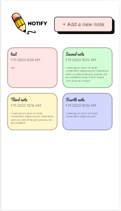
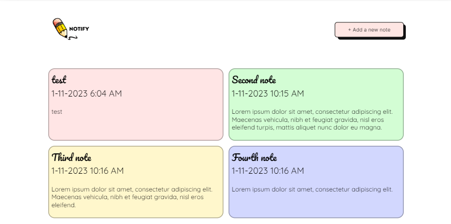

# Note Taking SPA Application

This is a simple Single Page Application (SPA) designed for note-taking purposes. It allows users to create, view, edit, and delete notes within a browser environment.

## Screenshots

## Features

- **Create Notes:** Add new notes with titles, content, and timestamps.

- **View Notes:** Browse through existing notes with timestamps and content.

- **Edit Notes:** Modify the title or content of existing notes.

- **Delete Notes:** Remove unwanted notes from the application.

## Technologies Used

- **JavaScript:** Vanilla JavaScript used for the frontend logic.

- **HTML & CSS:** Structuring and styling of the application.

- **Custom Web Components:** Utilized for modularizing different parts of the application.

- **Routing:** Implementing client-side routing for navigation between views.

- **Proxy:** Handling data and state management in the application.

- **Local Storage:** Storing notes locally within the browser.

## Usage

To run the application locally:

1\. Clone this repository to your local machine.

2\. Open the `index.html` file in a web browser.

3\. Explore the various features such as creating, editing, and deleting notes.

## Contributions

Contributions are welcome! If you find any bugs, issues, or have suggestions for improvements, feel free to create an issue or submit a pull request.

## Author

- **Eva Anokam** - *Initial work*

## License

This project is licensed under the MIT License - see the [LICENSE](LICENSE) file for details.
